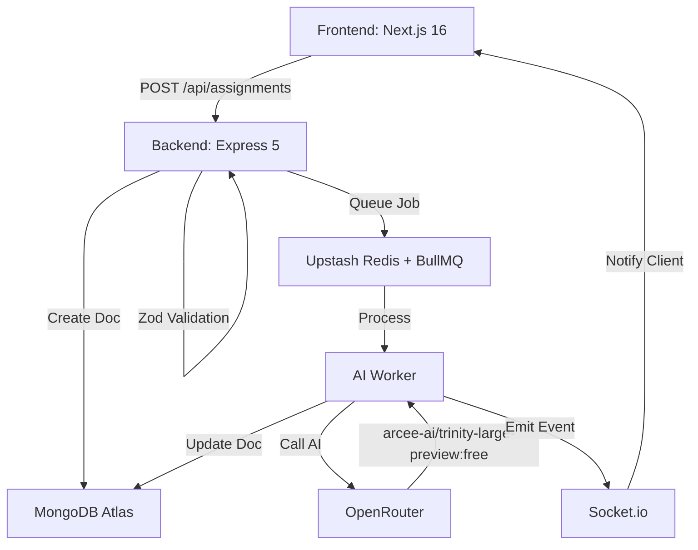

# Assignmento — AI Assessment Creator

An AI-powered assessment and question paper generator for teachers. Create professional, exam-ready question papers in minutes.

> [!IMPORTANT]
> **Current Limitation**: PDF and image uploading for context is currently **disabled**. Free AI models on OpenRouter do not yet support direct file/image analysis. AI generation relies on the user's "Additional Information" field only.

---

## Architecture Overview

Assignmento uses an asynchronous, worker-based architecture to handle AI generation without blocking the UI.



---

## Tech Stack

| Layer | Technology |
|---|---|
| Frontend | Next.js 16 (App Router), TypeScript, TailwindCSS 4 |
| State | Zustand, React Context |
| Backend | Node.js, Express 5 |
| Database | MongoDB Atlas (Mongoose) |
| Queue | BullMQ + Upstash Redis |
| Real-time | Socket.io |
| AI | OpenRouter — `arcee-ai/trinity-large-preview:free` |
| PDF | html2canvas + jsPDF |
| Icons | Lucide React |

---

## Project Structure

```
Assignmento/
├── backend/
│   ├── server.js                      # Entry point — HTTP server, Socket.io, worker init
│   ├── app.js                         # Express app — middleware, routes
│   ├── .env                           # Local environment variables
│   ├── .env.example                   # Environment variables template
│   ├── config/
│   │   ├── db.js                      # MongoDB connection
│   │   ├── openrouter.js              # OpenRouter AI client
│   │   └── redis.js                   # Redis/ioredis client
│   ├── models/
│   │   ├── assignmentModel.js         # Assignment schema with nested questions
│   │   ├── sectionSchema.js           # Nested schema for paper sections
│   │   ├── questionSchema.js          # Nested schema for questions
│   │   └── questionConfigItemSchema.js # Question type configuration schema
│   ├── controllers/
│   │   └── assignmentController.js    # HTTP handlers for assignment endpoints
│   ├── routes/
│   │   └── assignmentRouter.js        # CRUD endpoints for assignments
│   ├── middlewares/
│   │   └── errorHandler.js            # Global error handler
│   ├── services/
│   │   ├── assignmentService.js       # Business logic + Redis caching
│   │   └── aiService.js               # AI prompt execution + JSON parsing
│   ├── prompts/
│   │   └── assessmentPrompt.js        # Builds AI system prompt from question config
│   ├── queues/
│   │   └── aiQueue.js                 # BullMQ queue setup
│   ├── workers/
│   │   └── aiWorker.js                # Background AI job processor
│   └── socket/
│       └── socketHandler.js           # Socket.io room subscriptions
│
└── frontend/
    ├── app/
    │   ├── layout.tsx                 # Root layout (ToastProvider)
    │   ├── page.tsx                   # Redirects to /assignments
    │   ├── globals.css                # Global styles + CSS variables (light/dark)
    │   └── assignments/
    │       ├── page.tsx               # Assignment list/dashboard
    │       ├── create/page.tsx        # Create assignment form
    │       └── [id]/page.tsx          # Assignment detail + PDF preview
    ├── components/
    │   ├── layout/
    │   │   ├── AppShell.tsx           # Main layout wrapper
    │   │   ├── Header.tsx             # Top bar — page label, dark mode toggle
    │   │   ├── Sidebar.tsx            # Desktop sidebar navigation
    │   │   ├── MobileHeader.tsx       # Mobile top bar
    │   │   └── BottomNav.tsx          # Mobile bottom navigation
    │   ├── assignments/
    │   │   ├── AssignmentCard.tsx     # Individual assignment card
    │   │   ├── AssignmentGrid.tsx     # Grid + infinite scroll
    │   │   ├── AssignmentsShimmer.tsx # Skeleton loading state
    │   │   ├── SearchBar.tsx          # Search input
    │   │   └── EmptyState.tsx         # Empty list illustration
    │   ├── create/
    │   │   ├── CreateAssignmentForm.tsx  # Main creation form
    │   │   ├── QuestionConfigSection.tsx # Question type config table
    │   │   └── QuestionTypeRow.tsx       # Single question type row (steppers)
    │   ├── output/
    │   │   ├── QuestionPaper.tsx      # Full paper container
    │   │   ├── PaperHeader.tsx        # School/exam header
    │   │   ├── SectionBlock.tsx       # Paper section (MCQ, short answer, etc.)
    │   │   ├── QuestionItem.tsx       # Individual question display
    │   │   ├── AnswerKeySection.tsx   # Answer key
    │   │   └── ActionBar.tsx          # Print / Download / Back buttons
    │   └── ui/
    │       ├── Button.tsx             # Reusable button (primary/secondary/danger/ghost)
    │       ├── Toast.tsx              # Toast notifications
    │       ├── ThreeDotMenu.tsx       # Context menu (view/delete)
    │       ├── GenerationStartedModal.tsx  # Modal on generation start
    │       ├── GenerationCompleteToast.tsx # Toast on generation complete
    │       └── LoadingSpinner.tsx     # Spinner component
    ├── context/
    │   └── ToastContext.tsx           # Global toast state
    ├── hooks/
    │   ├── useAssignments.ts          # Assignment fetch/delete hooks
    │   ├── useSocket.ts               # Socket.io connection per page
    │   └── useBackgroundSocket.ts     # Background listener for generation events
    ├── lib/
    │   ├── api.ts                     # Axios instance (withCredentials)
    │   ├── socket.ts                  # Socket.io client init
    │   └── pdf.ts                     # HTML → PDF utility
    ├── store/
    │   └── useAssignmentStore.ts      # Zustand — assignments, loading, generation status
    └── types/
        └── assignment.ts              # TypeScript types
```

---

## API Endpoints

### Assignments — `/api/assignments`

| Method | Path | Description |
|--------|------|-------------|
| GET | `/api/assignments` | List assignments (paginated + search) |
| POST | `/api/assignments` | Create assignment + queue AI generation |
| GET | `/api/assignments/:id` | Get assignment detail |
| DELETE | `/api/assignments/:id` | Delete assignment |
| POST | `/api/assignments/:id/regenerate` | Re-queue AI generation |

### Socket.io Events

| Event (client → server) | Description |
|---|---|
| `subscribe:dashboard` | Join dashboard room for global updates |
| `subscribe:assignment` | Join room for a specific assignment's updates |
| `unsubscribe:assignment` | Leave assignment room |

| Event (server → client) | Description |
|---|---|
| `generation:processing` | AI job started |
| `generation:complete` | AI generation finished |
| `generation:error` | AI generation failed |

---

## Setup

### Prerequisites
- Node.js 20+
- MongoDB Atlas URI
- Upstash Redis URL (TLS)
- OpenRouter API key — [openrouter.ai](https://openrouter.ai)

### 1. Backend

```bash
cd backend
npm install
```

Create `backend/.env`:

```env
PORT=3000
MONGO_URI=your_mongodb_atlas_uri
REDIS_URL=your_upstash_redis_url
OPENROUTER_API_KEY=your_openrouter_key
AI_MODEL=arcee-ai/trinity-large-preview:free
FRONTEND_URL=http://localhost:8080
```

```bash
npm run dev
```

### 2. Frontend

```bash
cd frontend
npm install
```

Create `frontend/.env.local`:

```env
NEXT_PUBLIC_BACKEND_URL=http://localhost:3000
```

```bash
npm run dev
```

The app runs at **http://localhost:8080**.

---

## How It Works

1. **Create assignment** — User fills in the form (subject, class, question config). Frontend POSTs to `/api/assignments`.
2. **Async generation** — Backend validates with Zod, saves a `pending` Assignment, and pushes a job onto the BullMQ Redis queue. The response returns immediately.
3. **Background worker** — Picks up the job, calls the OpenRouter AI API with a structured JSON prompt, parses the response, and saves the generated content to MongoDB. Emits Socket.io events throughout.
4. **Real-time updates** — Frontend listens on Socket.io. When generation completes a toast appears with a link to the result.
5. **PDF output** — The question paper is rendered to HTML and converted to a downloadable PDF via html2canvas + jsPDF.

---

## Features

- **AI question paper generation** — Configurable question types, marks, and counts
- **Async job queue** — Generation never blocks the UI; runs in the background
- **Real-time notifications** — Socket.io push when generation completes
- **Dark / Light mode** — Toggleable theme, persisted in localStorage
- **PDF download & print** — Print-optimized A4 layout
- **Infinite scroll** — Paginated assignment list
- **Search** — Debounced assignment search
